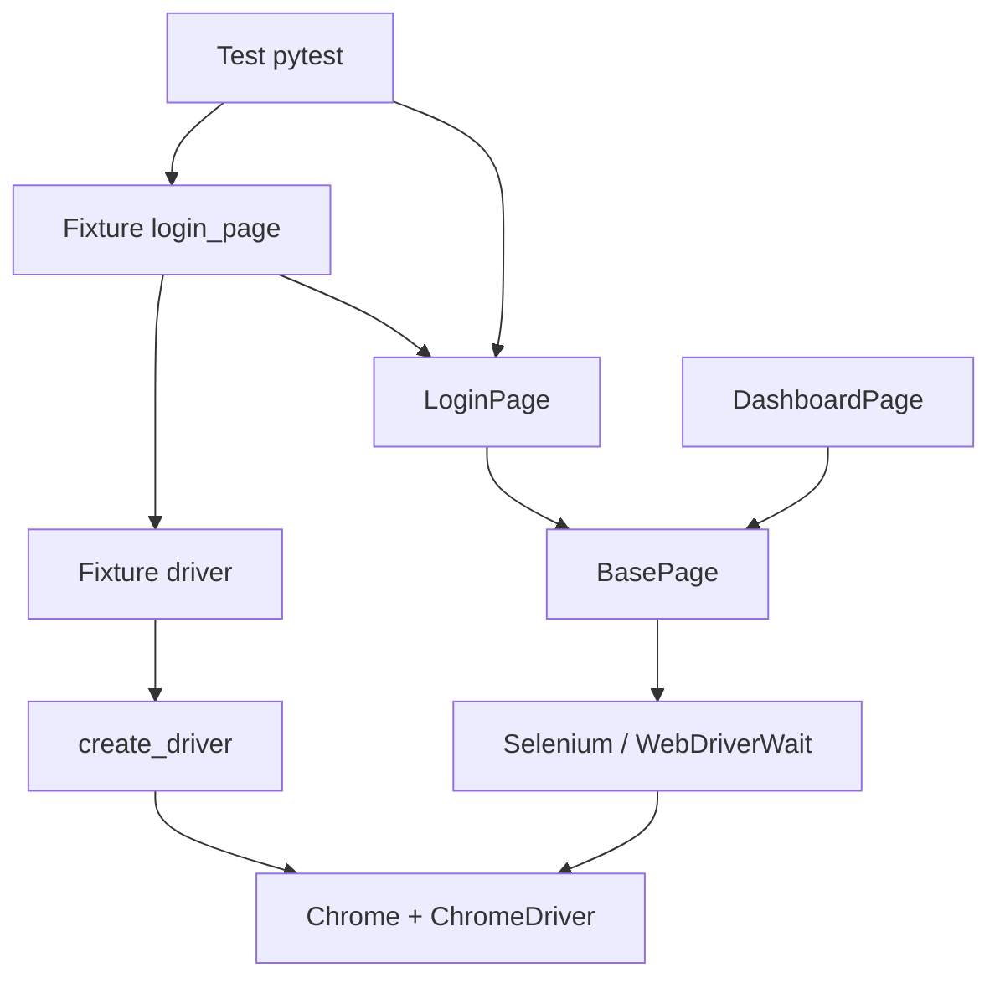
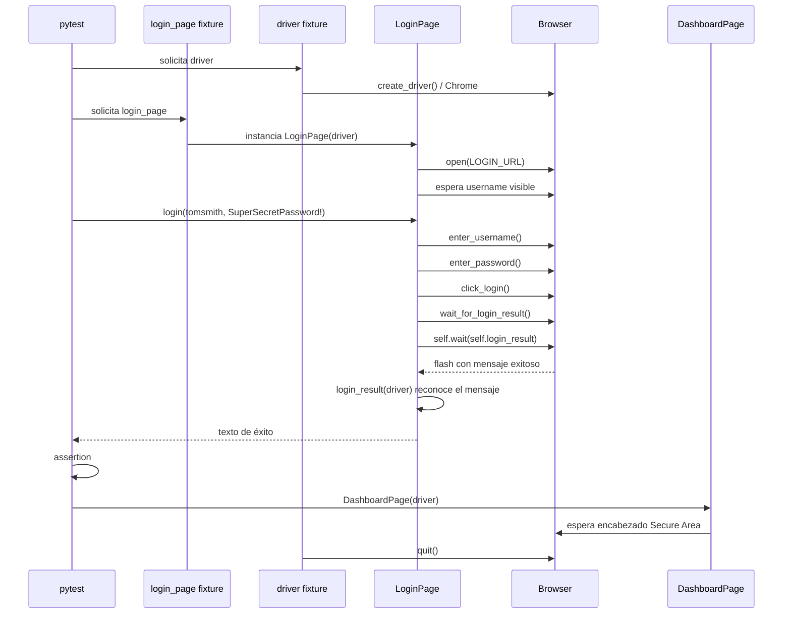

# Reporte técnico — QA Automation Framework

Este documento describe el estado actual del repositorio y da prioridad al código sobre el README.

## 1. Project Overview

El proyecto es un framework inicial de automatización UI para navegador, implementado en Python. Actualmente automatiza el flujo de inicio de sesión del sitio externo `https://the-internet.herokuapp.com/login`.

Su objetivo es encapsular interacciones de Selenium mediante Page Object Model (POM), reutilizar esperas explícitas y ejecutar pruebas con pytest.

Actualmente están implementados:

- Creación de un navegador Chrome con Selenium y WebDriver Manager.
- Configuración central de URL y timeout.
- `BasePage` con acciones y esperas reutilizables.
- Page Objects para Login y Dashboard.
- Fixtures de pytest para el ciclo de vida del navegador y `LoginPage`.
- Excepción de dominio `UnexpectedLoginResult` para resultados de login no reconocidos.
- Pruebas de login válido, inválido y de resultado inesperado.

## 2. Technology Stack

| Tecnología | Uso en el proyecto | Por qué se utiliza |
|---|---|---|
| Python | Lenguaje del framework y las pruebas. | Implementa páginas, fixtures, configuración y tests. |
| Selenium | Automatización del navegador. | Localiza elementos, escribe, hace clic, navega y espera condiciones UI. |
| Google Chrome | Navegador automatizado. | `create_driver()` crea exclusivamente un `webdriver.Chrome`. |
| WebDriver Manager | Gestión de ChromeDriver. | Descarga/localiza el driver compatible mediante `ChromeDriverManager().install()`. |
| pytest | Ejecución y organización de pruebas. | Descubre tests, resuelve fixtures y parametriza escenarios negativos. |
| Page Object Model | Patrón de organización. | Separa los detalles de UI (`pages/`) de la intención de negocio de los tests. |
| Git | Control de versiones. | El repositorio contiene historial y archivos versionados. |
| `python-dotenv`, `requests` | Dependencias declaradas. | Están en `requirements.txt`, pero el código actual no las importa ni utiliza directamente. |

`requirements.txt` también incluye paquetes auxiliares y transitivos de Selenium/pytest, todos con versiones fijadas. El entorno virtual registrado fue creado con Python 3.14.0.

## 3. Project Structure

```text
qa-automation-framework/
├── .gitignore
├── README.md
├── requirements.txt
├── conftest.py
├── exceptions.py
├── browser/
│   ├── __init__.py
│   └── driver.py
├── config/
│   ├── __init__.py
│   └── config.py
├── pages/
│   ├── __init__.py
│   ├── base_page.py
│   ├── dashboard_page.py
│   └── login_page.py
└── tests/
    ├── _init_.py
    └── test_login.py
```

- `.gitignore`: excluye entorno virtual, cachés Python, caché pytest, VS Code y archivos macOS.
- `requirements.txt`: dependencias exactas del entorno.
- `conftest.py`: define fixtures globales de pytest.
- `exceptions.py`: define excepciones de dominio del framework, actualmente `UnexpectedLoginResult`.
- `browser/driver.py`: crea, maximiza y devuelve el navegador Chrome.
- `config/config.py`: define `BASE_URL`, `LOGIN_URL` y timeout por defecto de 10 segundos.
- `pages/base_page.py`: clase base abstracta para Page Objects.
- `pages/login_page.py`: representa el formulario de login y su resultado.
- `pages/dashboard_page.py`: representa la página segura posterior a un login exitoso.
- `tests/test_login.py`: contiene los escenarios automatizados actuales.
- `tests/_init_.py`: archivo vacío. Su nombre tiene un guion bajo a cada lado de `init`, no el nombre convencional `__init__.py`; no afecta la colección actual de pytest, pero no convierte explícitamente `tests` en paquete Python.

## 4. Architecture

El framework usa Page Object Model:

- Los tests expresan el escenario y validan resultados.
- Las páginas encapsulan localizadores y acciones UI.
- `BasePage` concentra primitivas comunes de Selenium.
- Las fixtures construyen y destruyen el navegador.
- Selenium ejecuta las interacciones reales con Chrome.

`BasePage` es abstracta: obliga a cada página concreta a implementar `wait_until_loaded()`. `LoginPage` considera cargada la página al ser visible el campo de usuario; `DashboardPage`, cuando es visible el encabezado “Secure Area”.



## 5. Execution Flow: `pytest -v`

1. pytest busca archivos con su convención predeterminada; `tests/test_login.py` coincide.
2. Carga `conftest.py`, que expone las fixtures `driver` y `login_page`.
3. Para cada test que solicita `login_page`, pytest primero resuelve `driver`.
4. La fixture `driver` invoca `create_driver()`.
5. `create_driver()` instala/localiza ChromeDriver con WebDriver Manager, crea Chrome y maximiza la ventana.
6. La fixture `login_page` crea `LoginPage(driver)`, llama a `open()` y espera el campo de usuario.
7. El test ejecuta `login_page.login(usuario, contraseña)`.
8. `LoginPage` espera que cada campo y botón sea clickeable antes de interactuar.
9. Después del clic, `wait_for_login_result()` invoca `self.wait(self.login_result)`: Selenium consulta `login_result(driver)` hasta obtener un mensaje reconocido. Si obtiene un texto no reconocido, se lanza `UnexpectedLoginResult` de inmediato.
10. El test compara el texto devuelto con el resultado esperado.
11. Al terminar el test, pytest reanuda la fixture `driver` después de `yield` y ejecuta `driver.quit()`.

Las fixtures no declaran `scope`, por lo que usan el alcance predeterminado de pytest: una instancia por función de test. Cada caso parametrizado recibe un navegador nuevo.

```mermaid
flowchart TD
    A[pytest -v] --> B[Descubre tests/test_login.py]
    B --> C[Resuelve fixture login_page]
    C --> D[Resuelve fixture driver]
    D --> E[create_driver]
    E --> F[Chrome maximizado]
    F --> G[LoginPage.open]
    G --> H[Espera campo username visible]
    H --> I[Ejecuta test]
    I --> J[login: escribir y hacer clic]
    J --> K[wait_for_login_result: self.wait(login_result)]
    K --> L{¿Resultado reconocido?}
    L -->|Sí| M[Assertion]
    L -->|No| X[UnexpectedLoginResult]
    M --> N[Fin del test]
    N --> O[driver.quit]
```

## 6. Login Flow

`LoginPage` contiene estos localizadores:

- `USERNAME`: elemento con id `username`.
- `PASSWORD`: elemento con id `password`.
- `LOGIN_BUTTON`: elemento por clase `radius`.
- `FLASH_MESSAGE`: elemento con id `flash`.

Reconoce tres resultados mediante coincidencia parcial de texto:

| Resultado | Mensaje reconocido |
|---|---|
| Login exitoso | `You logged into a secure area!` |
| Usuario inválido | `Your username is invalid!` |
| Contraseña inválida | `Your password is invalid!` |

`login()` escribe credenciales, hace clic y devuelve `wait_for_login_result()`. Este método delega la espera en `self.wait(self.login_result)`, de modo que la espera y la evaluación están separadas.

`login_result(driver)` lee el texto de `FLASH_MESSAGE`, reconoce por coincidencia parcial los tres mensajes listados y devuelve el mensaje reconocido. Si el texto no coincide con ninguno, lanza `UnexpectedLoginResult` con el texto recibido. No devuelve un `DashboardPage`; el test exitoso lo crea explícitamente después de validar el mensaje.

```mermaid
flowchart TD
    A[LoginPage.login] --> B[Escribir username]
    B --> C[Escribir password]
    C --> D[Clic en Login]
    D --> E[wait_for_login_result]
    E --> F[self.wait(self.login_result)]
    F --> G[login_result(driver): leer flash message]
    G --> H{¿Mensaje conocido?}
    H -->|Éxito| I[Devuelve mensaje exitoso]
    H -->|Usuario inválido| J[Devuelve mensaje de usuario inválido]
    H -->|Contraseña inválida| K[Devuelve mensaje de contraseña inválida]
    H -->|Otro| L[Lanza UnexpectedLoginResult]
```

## 7. Synchronization Strategy

La sincronización actual se basa exclusivamente en esperas explícitas.

- `WebDriverWait`: creado en `BasePage.wait()`, con timeout por defecto de 10 segundos.
- `expected_conditions`: importado como `EC`.
- `wait()`: recibe una condición de Selenium o una función personalizada y espera hasta que devuelva un valor válido.
- `wait_for_visible()`: espera `EC.visibility_of_element_located(locator)`.
- `click()`: espera `EC.element_to_be_clickable(locator)` antes de hacer clic.
- `type()`: también espera que el elemento sea clickeable antes de enviar texto.
- `wait_until_loaded()`: contrato abstracto que cada Page Object implementa con su propia señal de carga.

Estas esperas reducen fallos por intentar interactuar con una UI todavía no visible o no interactuable. No hay espera implícita, `sleep`, reintentos configurables ni estrategia adicional de sincronización.

## 8. Error Handling

### Estado real de `UnexpectedLoginResult`

`exceptions.py` define `UnexpectedLoginResult`, una excepción de dominio para señalar que el resultado mostrado por el login no es uno de los resultados esperados por el framework.

`LoginPage.login_result(driver)` obtiene el texto de `FLASH_MESSAGE`, compara ese texto con los tres mensajes conocidos y devuelve el mensaje que reconoce. Cuando ninguno coincide, lanza `UnexpectedLoginResult` con el texto recibido. Por tanto, un resultado inesperado se informa de forma explícita y no se convierte intencionalmente en un timeout.

| Situación | Comportamiento actual |
|---|---|
| Resultado esperado de aplicación | `login_result(driver)` devuelve uno de los tres mensajes definidos; `wait_for_login_result()` lo devuelve mediante `self.wait(self.login_result)`. |
| Resultado inesperado de aplicación | `login_result(driver)` lanza `UnexpectedLoginResult` inmediatamente. |
| Timeout de Selenium | `WebDriverWait` puede lanzar `TimeoutException` si la condición no logra completarse dentro del timeout, por ejemplo si el flash no llega a estar disponible. Este caso es distinto de un texto de resultado no reconocido. |

## 9. Testing Strategy

Los tests son mayoritariamente UI end-to-end contra un sitio externo real y también incluyen una prueba unitaria del resultado inesperado. Cubren un caso positivo, dos negativos y la excepción de dominio.

| Test | Scenario | Expected Result |
|---|---|---|
| `test_valid_login` | Usuario `tomsmith` y contraseña `SuperSecretPassword!` | Mensaje de login exitoso y encabezado “Secure Area” visible. |
| `test_invalid_login[invalid_password]` | Usuario válido y contraseña inválida | Mensaje `Your password is invalid!`. |
| `test_invalid_login[invalid_username]` | Usuario inválido y contraseña válida | Mensaje `Your username is invalid!`. |
| `test_unexpected_login_result` | Un `Mock` del driver devuelve un flash con texto desconocido. | `login_result(driver)` lanza `UnexpectedLoginResult`. |

Detalles:

- `test_valid_login` usa la fixture `login_page`.
- Valida el texto de resultado y, después, crea `DashboardPage` para verificar que su encabezado sea visible.
- `test_invalid_login` usa `@pytest.mark.parametrize` para compartir la misma lógica con dos combinaciones de credenciales.
- Los casos tienen IDs legibles: `invalid_password` e `invalid_username`.
- Las assertions comparan igualdad exacta entre el resultado retornado y las constantes de `LoginPage`.
- `test_unexpected_login_result` usa `unittest.mock.Mock` para simular el driver y `pytest.raises(UnexpectedLoginResult)` para validar la excepción sin abrir un navegador.
- No hay una prueba automatizada específica para el timeout de Selenium.

## 10. Important Design Decisions

| Decisión existente | Implementación | Beneficio |
|---|---|---|
| Separar páginas de tests | `LoginPage` y `DashboardPage` encapsulan UI; `test_login.py` describe escenarios. | Reduce duplicación de localizadores e interacciones en pruebas. |
| Centralizar acciones comunes | `BasePage` implementa `click`, `type`, `wait`, `open` y `wait_for_visible`. | Mantiene comportamiento consistente entre páginas. |
| Exigir una señal de carga | `BasePage` es abstracta y requiere `wait_until_loaded()`. | Cada página define una condición explícita para considerarse lista. |
| Usar esperas explícitas | `WebDriverWait` y `expected_conditions`. | Evita depender de tiempos fijos. |
| Gestionar driver con fixtures | `driver` usa `yield` y luego `quit()`. | Aísla tests y libera el navegador al terminar. |
| Preparar LoginPage en fixture | `login_page` abre y espera la página antes de devolverla. | Los tests empiezan con una página de login lista. |
| Parametrizar negativos | Un único test recibe credenciales y resultados esperados. | Evita duplicar el mismo flujo de prueba. |
| Separar espera y evaluación del login | `wait_for_login_result()` ejecuta `self.wait(self.login_result)` y `login_result(driver)` evalúa el texto. | Aísla la coordinación de Selenium de la regla de negocio que interpreta el resultado. |
| Usar una excepción personalizada para resultados inesperados | `login_result(driver)` lanza `UnexpectedLoginResult` cuando el flash no coincide con los tres mensajes conocidos. | Distingue un resultado funcional desconocido de un problema técnico de sincronización o timeout. |

## 11. End-to-End Example: Valid Login



La secuencia exacta es:

`pytest → fixture → WebDriver → LoginPage → open() → enter_username() → enter_password() → click_login() → wait_for_login_result() → resultado → assertion → DashboardPage`.

## 12. Current Limitations

Estas son limitaciones actuales, no necesariamente errores:

- Solo se automatiza el flujo de login.
- Solo se crea Chrome; no hay selección de navegador.
- La URL está fija en código y no hay gestión de ambientes.
- Los tests dependen de un sitio externo, su disponibilidad, red y contenido.
- No hay reporting avanzado ni integración Allure implementada.
- No hay configuración CI/CD ni workflows de GitHub Actions en el repositorio.
- No hay capturas automáticas de pantalla.
- No hay logging propio del framework.
- No hay automatización API, validación de base de datos ni gestión de datos de prueba externa.
- No hay configuración pytest dedicada (`pytest.ini`, `pyproject.toml` o `tox.ini`).
- El entorno virtual actual no puede ejecutarse en este equipo porque su intérprete base configurado no está disponible.

## 13. Future Roadmap

| Estado | Alcance | Beneficio |
|---|---|---|
| CURRENT | Framework UI de login con Selenium, POM, fixtures y cuatro escenarios: válido, dos inválidos y resultado inesperado. | Base clara y pequeña para extender. |
| IMPLEMENTED | Esperas explícitas, ciclo de vida de Chrome, LoginPage, DashboardPage, parametrización negativa, separación entre espera y evaluación del resultado, y `UnexpectedLoginResult` con su prueba unitaria. | Pruebas más legibles, resultados inesperados diagnosticables y menor dependencia de tiempos fijos. |
| NEXT | Recuperar/recrear el entorno Python y verificar la ejecución reproducible. Añadir configuración de pytest y documentar el comando de instalación. | Facilita onboarding y ejecución consistente. |
| FUTURE | Configuración por ambiente y selección de navegador. | Permitirá ejecutar contra distintos entornos y navegadores. |
| FUTURE | Evidencias de ejecución: reportes, screenshots y logging. | Mejora diagnóstico de fallos. |
| FUTURE | CI/CD. | Ejecuta validaciones de forma automática en cambios. |
| FUTURE | Nuevos Page Objects y cobertura de otros flujos. | Amplía la cobertura funcional manteniendo el mismo patrón. |

## 14. How to Start Working on This Project

1. Lee primero `config/config.py`, `pages/base_page.py`, `pages/login_page.py`, `conftest.py` y `tests/test_login.py`.
2. Antes de modificar código, entiende que los tests dependen de fixtures por función y de un sitio externo.
3. Normalmente, ejecuta:

   ```powershell
   python -m pytest -v
   ```

   En este repositorio, el `.venv` actual apunta a Python 3.14.0 en una ruta no disponible; primero debe restaurarse un intérprete/entorno válido.

4. Interpreta cada caso de pytest como un escenario individual; los dos negativos aparecen con sus IDs parametrizados.
5. Conoce primero estos archivos: `browser/driver.py`, `config/config.py`, `pages/base_page.py`, `pages/login_page.py`, `conftest.py` y `tests/test_login.py`.
6. Para agregar un test, reutiliza la fixture `login_page`, invoca métodos del Page Object y valida el resultado desde el test.
7. Para agregar un Page Object, crea una clase que herede de `BasePage`, define sus localizadores y acciones, e implementa `wait_until_loaded()` usando una señal real de disponibilidad.
8. Mantén localizadores y acciones UI dentro de los Page Objects; evita poner Selenium directo en los tests.
9. No agregues esperas fijas con `sleep`; usa las primitivas de espera explícita existentes.
10. No asumas que hay reporting, CI o múltiples ambientes: actualmente no existen. Sí hay un `Mock` y una excepción de negocio para el resultado inesperado de login.

## 15. Glossary

- **Page Object Model:** patrón que representa cada página mediante una clase. En este proyecto, `LoginPage` y `DashboardPage` encapsulan elementos y acciones de UI.
- **Fixture:** función que prepara recursos para los tests. Aquí `driver` crea y cierra Chrome, y `login_page` abre el formulario de login.
- **Explicit Wait:** espera controlada hasta que se cumpla una condición UI. `BasePage.wait()` usa `WebDriverWait`.
- **WebDriver:** interfaz de Selenium que controla el navegador. El proyecto crea un WebDriver de Chrome.
- **Expected Condition:** condición reutilizable de Selenium, como “elemento visible” o “clickeable”. Se usa mediante `EC`.
- **Parametrization:** ejecución de un test con múltiples datos. `test_invalid_login` se ejecuta para contraseña inválida y usuario inválido.
- **Mock:** objeto simulado para aislar dependencias. `test_unexpected_login_result` usa `unittest.mock.Mock` para simular el driver y su elemento flash.
- **Exception:** señal de un error o condición excepcional. `UnexpectedLoginResult` es la excepción personalizada que indica un texto de resultado de login no reconocido.
- **Assertion:** validación de una expectativa de prueba. Los tests comparan el mensaje retornado con una constante esperada.

## 16. Technical Summary

La arquitectura actual es un framework UI pequeño basado en Selenium, pytest y Page Object Model. El flujo principal crea un Chrome por test, abre la página de login, ejecuta acciones sincronizadas con esperas explícitas, identifica el mensaje flash y valida el resultado.

Sus componentes principales son `BasePage`, `LoginPage`, `DashboardPage`, `UnexpectedLoginResult`, las fixtures de pytest y el creador de WebDriver. La estrategia de testing cubre un login válido, dos fallos de autenticación parametrizados y un resultado inesperado simulado.

Las fortalezas actuales son la separación básica por responsabilidades, las esperas explícitas, la limpieza del navegador y la legibilidad de los escenarios. Los siguientes pasos recomendados son restaurar un entorno ejecutable, actualizar la documentación y extender la cobertura sin perder esta separación.

## Repository Analysis Notes

### Archivos analizados

- `.gitignore`
- `README.md`
- `requirements.txt`
- `conftest.py`
- `exceptions.py`
- `browser/__init__.py`
- `browser/driver.py`
- `config/__init__.py`
- `config/config.py`
- `pages/__init__.py`
- `pages/base_page.py`
- `pages/dashboard_page.py`
- `pages/login_page.py`
- `tests/_init_.py`
- `tests/test_login.py`

También se revisó la configuración del entorno virtual (`.venv/pyvenv.cfg`) y la caché de pytest como evidencia auxiliar.

### Posibles inconsistencias

- El README indica que pytest y Page Object Model están “Coming Soon”, pero ambos ya están implementados.
- El README menciona GitHub Actions y Allure Reports como futuros; no hay archivos que los implementen.
- `tests/_init_.py` no usa el nombre convencional `__init__.py`.

### Aspectos no determinables con certeza

- No fue posible ejecutar o colectar tests desde el entorno actual: `.venv` fue creado contra `C:\Users\itzel\AppData\Local\Programs\Python\Python314\python.exe`, instalación que no está disponible/accesible.
- Por ello, no se puede confirmar desde esta máquina el resultado actual de la suite ni la compatibilidad efectiva de Chrome/ChromeDriver.
